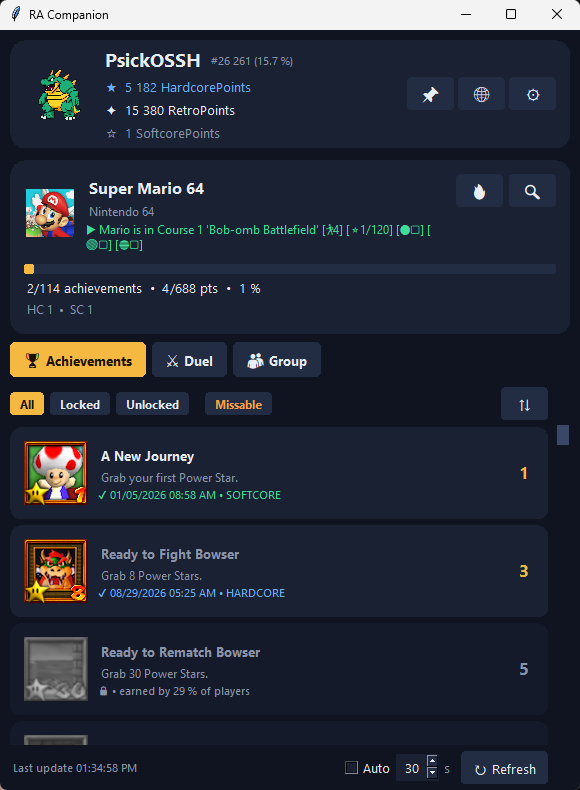
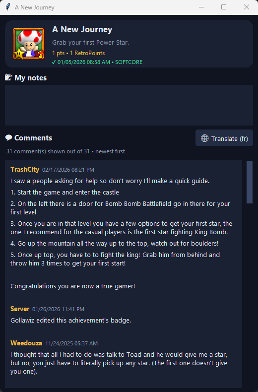
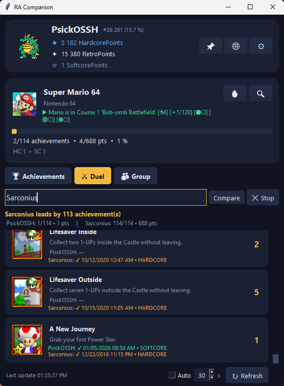
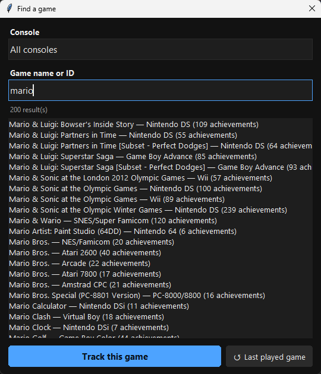

> **AI-assisted project.** The code of this project was written with the help of an AI assistant,
> directed and tested by the author. Expect rough edges and please report any bug you find.

# RA Companion



| Achievement detail | Duel | Group | Skin |
|---|---|---|---|
|  |  |  |  |

A small Windows desktop companion for [RetroAchievements](https://retroachievements.org): keep it open next to your
emulator and follow your progress live.

## Features

- **Live profile**: hardcore / softcore points, RetroPoints, rank and percentile, current game with rich presence
- **Achievement list**: filters (all / locked / unlocked) combined with a *missable* toggle, 11 sort orders,
  optional hardcore-only counting, badges, unlock dates in your language and time zone
- **Notifications** when you (or your friend) unlock an achievement
- **Duel**: compare your progress with a friend on the same game, see who is ahead and who unlocked what
- **Group dashboard**: follow several players at once, ranked by progress on the current game
- **Personal notes** per achievement and the community **comments**, with one-click **translation**
- **Game search** by name (all consoles or a single one) to track any game
- **Compact desktop UX**: rounded interface, hover animations, always-on-top mode, adjustable opacity,
  automatic refresh with a configurable interval (or manual refresh with `F5`)
- **6 interface languages** (English, Français, Español, Deutsch, Italiano, Português) and **skins**
  (default, dark and light are included)

## Requirements

- Windows (the interface uses the Segoe UI fonts; other platforms are untested)
- Python 3.9 or newer with Tkinter (included in the official Windows installer)
- A RetroAchievements account and its Web API key
  (<https://retroachievements.org/settings?tab=applications>)

No third-party package is required.

## Run

```
python ra_companion.py
```

On first launch the settings window opens: enter your username and your Web API key.

## Project layout

```
ra_companion.py      entry point
app.py               main window and application logic
widgets.py           rounded cards / buttons, tooltips, mixed-font labels, progress bar
ra_api.py            RetroAchievements Web API, downloads, translation
i18n.py              UI translations
utils.py             formatting, achievement helpers, sorting
config.py            paths, constants, persistent settings
skins/
    __init__.py      skin loader (do not delete)
    default.py       default skin (documented reference)
    dark.py          dark skin
    light.py         light skin
```

`skins/__init__.py` must stay inside the `skins` folder, next to the skin files.

## Creating a skin

1. Copy `skins/default.py` to `skins/my_skin.py` (any name not starting with an underscore).
2. Change `NAME` and any color / font / corner radius. Variables you remove fall back to the default skin,
   so a skin can override just a few values.
3. Open **Settings -> Skin** and select it. The application restarts to apply it.

Every variable is documented in `skins/default.py`. When you add a skin variable to the code, also add it to
`default.py` so that other skins keep working.

## Adding a UI language

In `i18n.py`, copy the `"en"` block of `I18N`, translate the values, then add the language to `UI_LANGS`
and `REFRESH_LABELS` (and to the sort labels in `SORT_LABELS`). Date formats are in `utils.py`
(`DATE_FMT` / `DAY_FMT`).

## Data, privacy and network

- Your settings (including the **API key**, stored as plain text), notes and the game index cache are saved in your
  home directory as `.ra_companion*.json`. Never publish these files.
- Network access: the RetroAchievements API and media server (profile, games, badges, comments), the public
  Google Translate endpoint (only when translation is enabled, the translated texts are sent to it), and
  one-time downloads of the GitHub / RetroAchievements logos shown in the settings (cached locally).
- The RetroAchievements API asks clients to cache data and avoid excessive requests: the game list of each console
  is downloaded once and kept for 30 days.

## Troubleshooting

- `cannot import name 'active' from 'skins'`: the `skins` folder has no `__init__.py`; put it back next to
  `default.py`.
- Nothing is displayed: check your username and Web API key in the settings.

## License

Released under the [MIT License](LICENSE).

## Credits

Data and badges come from [RetroAchievements](https://retroachievements.org). This project is not affiliated with
RetroAchievements.
